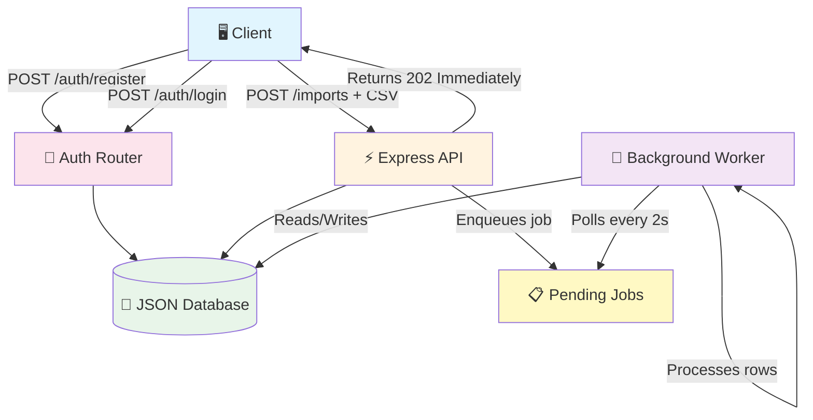
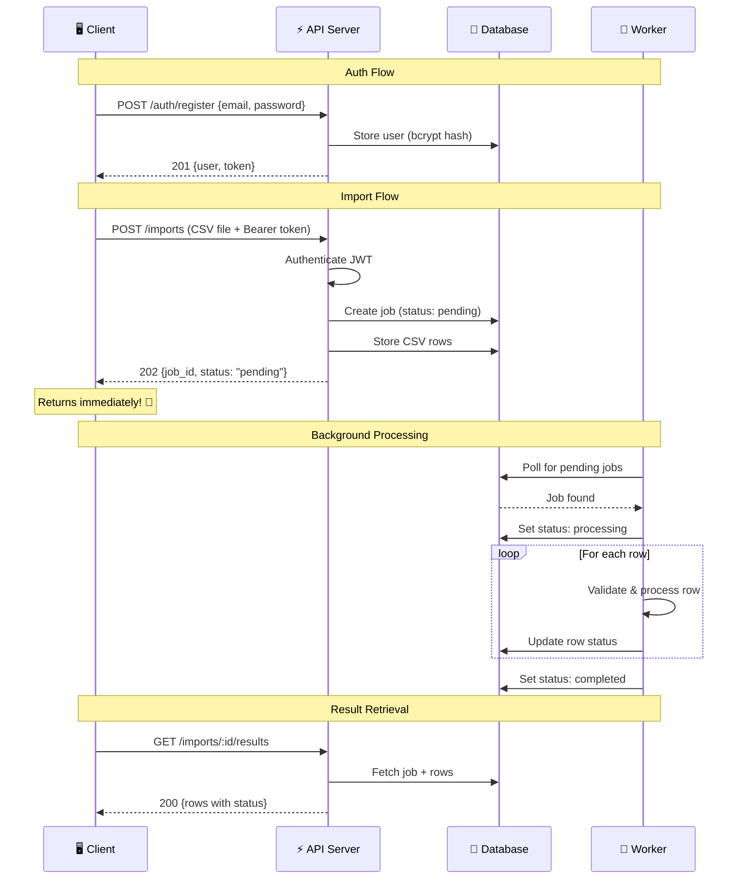
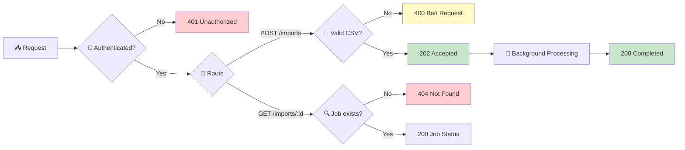
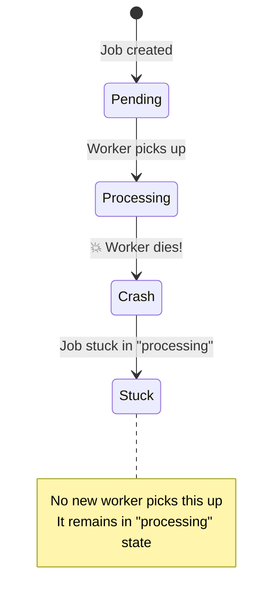
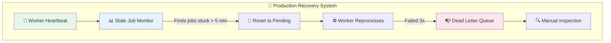
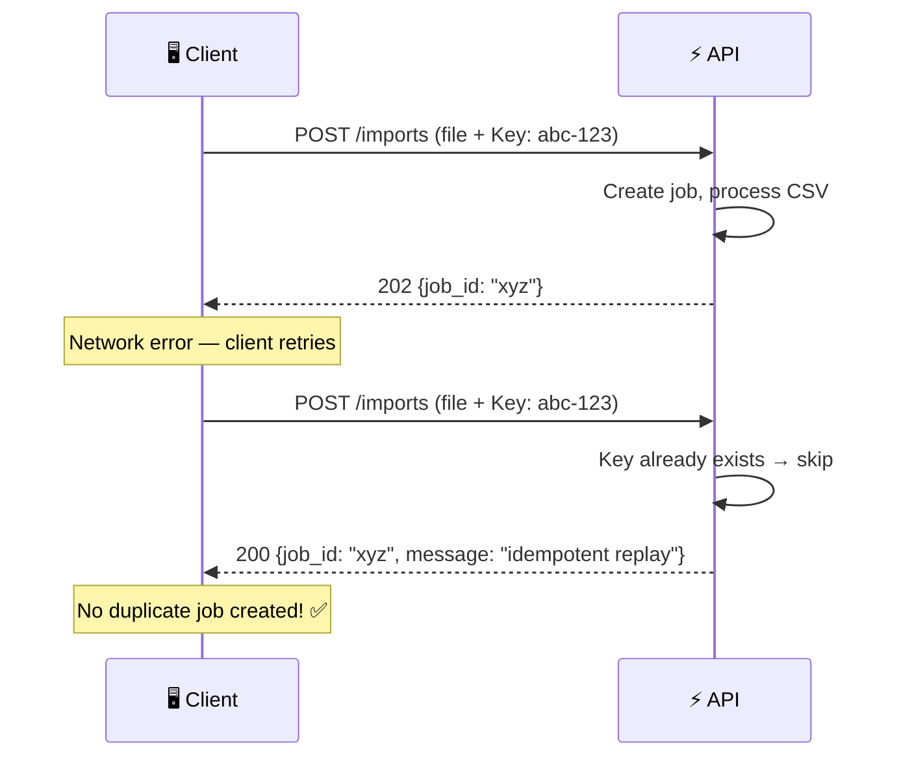

<div align="center">

# CSV Import Service

### Background Job Processing with Idempotent Writes

[](https://nodejs.org)
[](https://expressjs.com)
[](https://jwt.io)
[](https://behind-the-service.onrender.com)
[](#license)

**Live URL:** [https://behind-the-service.onrender.com](https://behind-the-service.onrender.com)  
**Repository:** [github.com/techtuber9988/behind-the-service](https://github.com/techtuber9988/behind-the-service)

</div>

---

## Table of Contents

- [Overview](#-overview)
- [Architecture](#-architecture)
- [Request Flow](#-request-flow)
- [API Endpoints](#-api-endpoints)
- [Usage Examples](#-usage-examples)
- [Error Responses](#-error-responses)
- [What Happens When the Worker Dies Mid-Job](#-what-happens-when-the-worker-dies-mid-job)
- [Environment Variables](#-environment-variables)
- [Local Setup](#-local-setup)

---

## Overview

This service demonstrates the **background job pattern**: the request that triggers work returns immediately (HTTP 202), and the actual processing happens behind the scenes. A caller never waits for the slow part.

| Requirement | Implementation |
|:---|:---|
| Deployed service with public URL | Deployed on Render at `behind-the-service.onrender.com` |
| Authentication | JWT tokens with bcrypt password hashing |
| Write path safe to retry | Idempotency keys on CSV upload |
| Error responses a caller can act on | Structured `{error, message}` with typed error codes |
| Background job behind the response | Worker polls every 2s, processes CSV rows asynchronously |
| Same outcome when run twice | Idempotent replay returns existing job, no duplicates |
| 401 without credentials | All protected routes return 401 with descriptive error |
| No secrets committed | `.env` excluded from git, `JWT_SECRET` in Render env vars |

---

## Architecture



### Tech Stack

| Component | Technology | Purpose |
|:---|:---|:---|
| **Runtime** | Node.js 18+ | Server runtime |
| **Framework** | Express.js 4.x | HTTP routing and middleware |
| **Authentication** | JWT + bcrypt | Stateless auth with secure password hashing |
| **Database** | JSON file (lowdb-style) | Lightweight persistence for users, jobs, and rows |
| **File Upload** | Multer | Multipart form handling |
| **Worker** | In-process polling | Background job processing every 2 seconds |
| **Hosting** | Render | Free-tier deployment with auto-deploy from GitHub |

---

## Request Flow



---

## API Endpoints

### Authentication

| Method | Endpoint | Auth | Description |
|:---:|:---|:---:|:---|
| `POST` | `/auth/register` | ❌ | Create a new account |
| `POST` | `/auth/login` | ❌ | Get a JWT token |

### Imports

| Method | Endpoint | Auth | Description |
|:---:|:---|:---:|:---|
| `POST` | `/imports` | ✅ | Upload CSV — returns **202** immediately |
| `GET` | `/imports/:id` | ✅ | Check job status |
| `GET` | `/imports/:id/results` | ✅ | Get processed results (when completed) |

### Health

| Method | Endpoint | Auth | Description |
|:---:|:---|:---:|:---|
| `GET` | `/health` | ❌ | Health check |

---

## Usage Examples

### 1. Register

```bash
curl -X POST https://behind-the-service.onrender.com/auth/register \
  -H "Content-Type: application/json" \
  -d '{"email":"user@example.com","password":"securepass123"}'
```

<details>
<summary>Response (201)</summary>

```json
{
  "user": {
    "id": "a1b2c3d4-...",
    "email": "user@example.com"
  },
  "token": "eyJhbGciOiJIUzI1NiIs..."
}
```

</details>

### 2. Login

```bash
curl -X POST https://behind-the-service.onrender.com/auth/login \
  -H "Content-Type: application/json" \
  -d '{"email":"user@example.com","password":"securepass123"}'
```

### 3. Upload CSV (Returns 202 Immediately)

```bash
curl -X POST https://behind-the-service.onrender.com/imports \
  -H "Authorization: Bearer <token>" \
  -H "Idempotency-Key: 550e8400-e29b-41d4-a716-446655440000" \
  -F "file=@contacts.csv"
```

<details>
<summary>Response (202)</summary>

```json
{
  "job_id": "a462bb0d-d8fd-4895-...",
  "status": "pending",
  "message": "Import accepted. Processing will happen in the background.",
  "row_count": 3,
  "status_url": "/imports/a462bb0d-d8fd-4895-..."
}
```

</details>

### 4. Check Job Status

```bash
curl https://behind-the-service.onrender.com/imports/<job_id> \
  -H "Authorization: Bearer <token>"
```

<details>
<summary>Response (200)</summary>

```json
{
  "job_id": "a462bb0d-d8fd-4895-...",
  "status": "completed",
  "original_filename": "contacts.csv",
  "row_count": 3,
  "processed_count": 3,
  "created_at": "2026-09-18T18:20:42.935Z",
  "started_at": "2026-09-18T18:20:43.124Z",
  "completed_at": "2026-09-18T18:20:43.427Z"
}
```

</details>

### 5. Get Results (After Completion)

```bash
curl https://behind-the-service.onrender.com/imports/<job_id>/results \
  -H "Authorization: Bearer <token>"
```

<details>
<summary>Response (200)</summary>

```json
{
  "job_id": "a462bb0d-d8fd-4895-...",
  "status": "completed",
  "row_count": 3,
  "rows": [
    {"index": 0, "data": "Alice,alice@example.com", "status": "completed", "error": null},
    {"index": 1, "data": "Bob,bob@example.com", "status": "completed", "error": null},
    {"index": 2, "data": "Charlie,charlie@example.com", "status": "completed", "error": null}
  ]
}
```

</details>

---

## Error Responses

All errors follow a consistent format:

```json
{
  "error": "error_code",
  "message": "Human-readable description of what went wrong"
}
```

| Status | Code | When |
|:---:|:---|:---|
| `400` | `missing_fields` | Email or password not provided |
| `400` | `missing_file` | No CSV file in upload |
| `400` | `weak_password` | Password shorter than 8 characters |
| `401` | `missing_credentials` | No `Authorization` header |
| `401` | `invalid_token` | JWT is malformed or user no longer exists |
| `401` | `token_expired` | JWT has expired (7-day lifetime) |
| `401` | `invalid_credentials` | Wrong email or password |
| `404` | `not_found` | Job does not exist or belongs to another user |
| `409` | `email_taken` | Email already registered |
| `409` | `not_ready` | Results requested before job completed |



---

## What Happens When the Worker Dies Mid-Job

> **The question:** If the worker crashes or is killed while processing a job, what happens?

### Scenario



### How the Service Handles It

| # | Guarantee | Details |
|:---|:---|:---|
| 1 | **Data is never lost** | All CSV rows are persisted in the database before processing starts. Even if the worker dies, the raw data is preserved. |
| 2 | **Caller always knows** | `GET /imports/:id` returns the current status. A stuck job shows `status: "processing"` indefinitely — the caller can detect this. |
| 3 | **No duplicate work** | Idempotency keys prevent duplicate jobs. Retrying the same request returns the existing (stuck) job, not a new one. |
| 4 | **No data corruption** | Rows are processed one at a time with individual status tracking. Partial progress is preserved. |
| 5 | **Known limitation** | This implementation does **not** auto-recover stuck jobs. In production, you would add a stale job detector. |

### Production Improvements



- **Stale job recovery**: Periodic task resets `processing` jobs older than a threshold back to `pending`
- **Worker heartbeat**: Worker writes a timestamp; a supervisor checks it and restarts the worker if stale
- **Dead letter queue**: Failed jobs (after N retries) move to a separate queue for manual inspection
- **Observability**: Structured logging, metrics, and alerts on stuck/failed jobs

---

## Retry Safety

Include an `Idempotency-Key` header on `POST /imports`:

```
Idempotency-Key: 550e8400-e29b-41d4-a716-446655440000
```



If the same key is used twice, the second request returns the existing job instead of creating a duplicate.

---

## Environment Variables

| Variable | Required | Default | Description |
|:---|:---:|:---|:---|
| `PORT` | ❌ | `3000` | Server port |
| `JWT_SECRET` | ✅ | — | Secret key for signing JWT tokens |
| `DATABASE_PATH` | ❌ | `./data/database.json` | Path to JSON database file |
| `UPLOAD_DIR` | ❌ | `./uploads` | Temporary upload directory |

> **Security:** `JWT_SECRET` is never committed to the repository. It is configured as an environment variable in the Render dashboard.

---

## Local Setup

```bash
# Clone the repository
git clone https://github.com/techtuber9988/behind-the-service.git
cd behind-the-service

# Install dependencies
npm install

# Create environment file
cp .env.example .env

# Edit .env and set JWT_SECRET to a random string
# JWT_SECRET=your-random-secret-here

# Start the server
npm start
```

The server starts at `http://localhost:3000`.

---

## License

MIT
